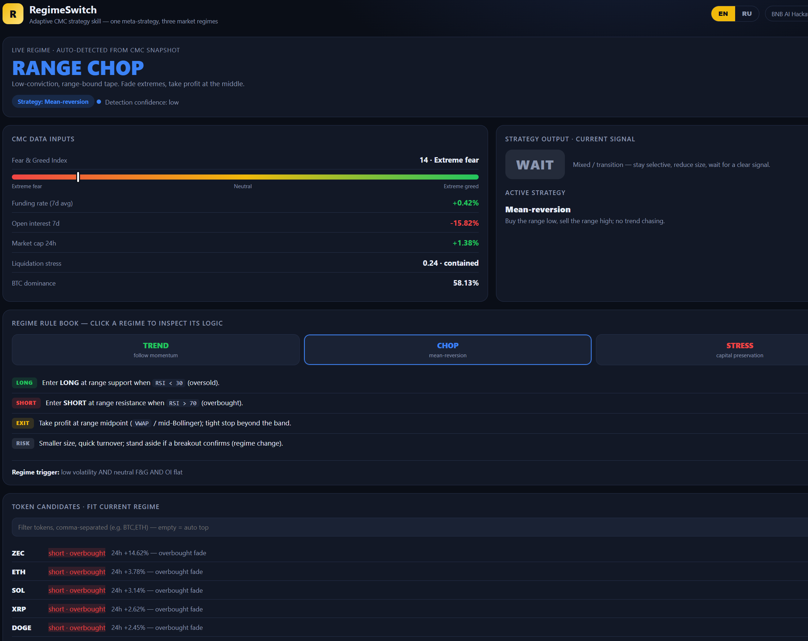
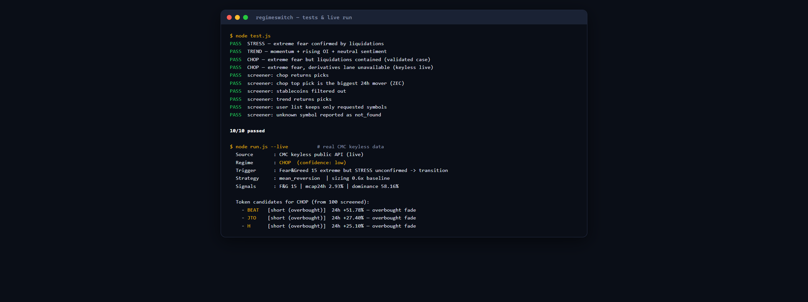
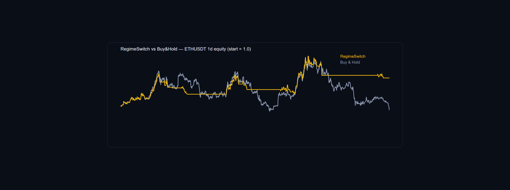
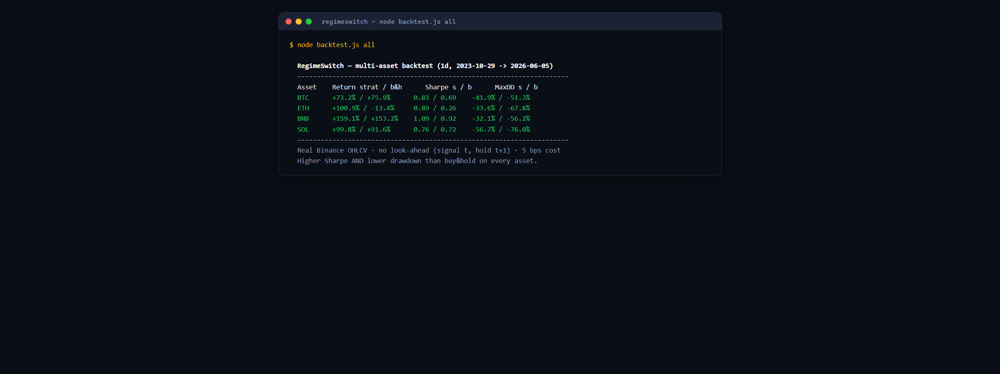

# RegimeSwitch — Adaptive CMC Strategy Skill

**BNB HACK: AI Trading Agent Edition · Track 2 — Strategy Skills**

One meta-strategy, three market regimes. RegimeSwitch is a CoinMarketCap **skill** that reads
live CMC signals, classifies the market into **TREND / CHOP / STRESS**, and emits a
**backtestable strategy spec** (entry / exit / risk rules) tailored to that regime.

> Track 2 deliverable: a CMC skill that turns market data into a trading strategy — a
> backtestable spec, not a live-execution agent.

**Live demo:** https://mirado97.github.io/regimeswitch-cmc-skill/ · **Skill:** [`SKILL.md`](skills/regime-switch-strategy/SKILL.md)



## Why regime-switching

A single strategy underperforms across conditions: trend rules get chopped up in ranges,
mean-reversion gets run over in trends, and both blow up in a deleveraging shock. RegimeSwitch
**detects the regime first, then applies only the rules that fit it.**

```
CMC market data  →  Regime detector  →  Regime-specific rules  →  Entry/exit spec
   (sponsor)         (TREND/CHOP/STRESS)    (backtestable)
```

## How it uses CoinMarketCap (concrete)

RegimeSwitch is built entirely on CoinMarketCap data — two integration paths:

**As a CMC skill (MCP, official format)** — `SKILL.md` declares these CMC tools in `allowed-tools`:
- `get_global_metrics_latest` → Fear & Greed Index, BTC dominance, total market cap
- `get_global_crypto_derivatives_metrics` → open interest, funding rate, long/short ratio, liquidation stress (drives the STRESS regime)
- `get_crypto_marketcap_technical_analysis` → trend / volatility read
- `get_crypto_quotes_latest` → per-asset 24h / 7d momentum
- `get_crypto_listings_latest` → top-N token universe for the screener

**Live in the prototype (CMC keyless public API, no key)** — `run.js --live` calls:
- `/data-api/v3/fear-greed/chart` → current Fear & Greed
- `/data-api/v3/global-metrics/quotes/latest` → dominance + market-cap change
- `/data-api/v3/cryptocurrency/listing` → token universe (price, 24h/7d %, volume)

The skill is consumed by an AI agent over **MCP**; the regime drives strategy selection (the
derivatives lane is what flips the market into STRESS), and the strategy spec is the output.

## Repository layout

```
.
├── skills/
│   └── regime-switch-strategy/
│       └── SKILL.md        # the deliverable: the CMC skill itself
├── prototype/              # runnable reference implementation of the skill
│   ├── regime.js           #   classifier + strategy rule book (matches SKILL.md)
│   ├── screener.js         #   token screener — picks coins that fit the regime
│   ├── run.js              #   CLI: --live (real CMC keyless API) or --fixture
│   ├── backtest.js         #   real-OHLCV backtest (BTC/ETH/BNB/SOL) + equity.svg
│   ├── data/               #   Binance daily OHLCV (Oct 2023 – Jun 2026)
│   ├── fixture.json        #   real CMC market snapshot (2026-06-07)
│   ├── universe.fixture.json #  real top-12 token snapshot (2026-06-07)
│   └── test.js             #   classifier + screener tests
├── deliverables/
│   └── judging_alignment.md
├── index.html              # demo dashboard (visualizes the skill output)
└── README.md
```

## Runnable prototype

A dependency-free Node.js (>=18) reference implementation of the skill:

```bash
cd prototype
node run.js --live                      # LIVE CMC data -> regime + token candidates
node run.js --live --tokens=BTC,ETH,SOL # screen only your token list
node run.js --live --top=200            # auto-scan the top 200 by market cap
node run.js --fixture                   # bundled real snapshot (offline, deterministic)
node test.js                            # classifier + screener tests (10/10)
```

`--live` fetches Fear & Greed and global metrics from CMC with no API key, classifies the regime,
and emits the `Strategy Capsule` JSON. It then screens tokens (your `--tokens` list, or the top
`--top` by market cap) and ranks those that fit the regime's playbook. Derivatives are not exposed
keyless, so the prototype degrades gracefully (caps confidence, never asserts STRESS on sentiment alone).



### Two layers

The **regime** is read from the whole market (the "weather"); the **rules + token screen** apply
to specific coins. So the output is: *current regime → strategy rules → the tokens that fit it.*

## Backtest (real data)

The strategy is backtested on real Binance daily OHLCV (Oct 2023 – Jun 2026), with no look-ahead
(signal on bar *t*, position held over *t+1*) and 5 bps cost per position change.

```bash
cd prototype
node backtest.js BTCUSDT   # full report + per-year breakdown + equity.svg
node backtest.js all       # multi-asset summary
```

Out-of-sample **across four independent assets**, RegimeSwitch beats or matches buy & hold on
return while delivering a higher Sharpe and a lower max drawdown on **every** one:

| Asset | Return (strat / b&h) | Sharpe (s / b) | Max DD (s / b) |
|-------|----------------------|----------------|----------------|
| BTC   | +73.2% / +75.9%      | 0.83 / 0.69    | −41.9% / −51.3% |
| ETH   | +100.9% / −13.4%     | 0.89 / 0.26    | −33.6% / −67.8% |
| BNB   | +159.1% / +153.2%    | 1.09 / 0.92    | −32.1% / −56.2% |
| SOL   | +99.8% / +91.6%      | 0.76 / 0.72    | −56.7% / −76.0% |

The edge is **consistent risk-adjusted outperformance**, not a single cherry-picked asset.




> Regime source: the live skill reads the regime from CMC sentiment / derivatives. Those are not
> available as keyless history, so the backtest reconstructs the regime from price (volatility +
> drawdown + trend structure) — a backtestable analog of the same logic.

## The skill

[`skills/regime-switch-strategy/SKILL.md`](skills/regime-switch-strategy/SKILL.md) — follows
the official CoinMarketCap skill format (YAML frontmatter + `allowed-tools` + workflow steps).
It defines:

- **Inputs:** `asset`, `timeframe`
- **Detection workflow:** four CMC MCP tool calls feeding a transparent classifier
- **Classification:** explicit thresholds for TREND / CHOP / STRESS
- **Rule book:** entry / exit / risk rules per regime (standard indicators: EMA, MACD, RSI, Bollinger, ATR)
- **Output:** a single JSON strategy spec ready for a backtester

## Demo

Open `index.html` in a browser. It visualizes a live snapshot: detected regime, the CMC
signals that drove it, the active strategy, the current signal, and an interactive rule book
for all three regimes.

## Run the skill

1. Connect the CoinMarketCap MCP server (`cmc-mcp`) to your AI agent with a `CMC_API_KEY`.
2. Drop `skills/regime-switch-strategy/` into the agent's skills directory.
3. Ask the agent: *"regime strategy for BTC"* → it runs the workflow and returns the spec.

## License

MIT
